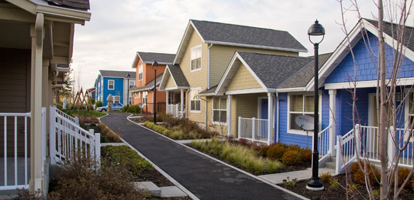

# KC HOUSES PROJECT

  

# Objective

Genarate insights and find better business opportunities for a real estate company.
  
# Context

House Rocket is a fictitious real estate business that adopts the flipping strategy. This strategy consists of buying properties that need repair, fixing, and selling them for profit. The House Rocket has a budget of 120 million dollars to invest in properties, and they would like to know which properties they should buy, also for what price to sell them.

# Business Problem

Find the best properties to be renovated and maximize the company's profit.

    1. Which properties should the company buy, and for what price?

    2. Once bought, for what price should the company sell it?

# Data

 In this project, I used a [database](https://www.kaggle.com/datasets/harlfoxem/housesalesprediction) from a [Kaggle](https://www.kaggle.com/)
 competition. This database has information about properties in King County from  Seattle, Washington - D.C - United States.

## Data Dictionary

|Variable|Description|
|--------|-----------|
|id|Identification|
|date|	Date sold|
|price|	Sale price
|bedrooms|	Number of bedrooms|
|bathrooms|	Number of bathrooms|
|sqft_liv|	Size of living area in square feet|
|sqft_lot|	Size of the lot in square feet|
|floors|	Number of floors|
|waterfront|	‘1’ if the property has a waterfront, ‘0’ if not.|
|view|	An index from 0 to 4 of how good the view of the property was|
|condition|	Condition of the house, ranked from 1 to 5|
|grade|	Classification by construction quality which refers to the types of materials used and the quality of workmanship. Buildings of better quality (higher grade) cost more to build per unit of measure and command higher value.|
|sqft_above|	Square feet above ground|
|sqft_basmt|	Square feet below ground|
|yr_built|	Year built|
|yr_renov|	Year renovated. ‘0’ if never renovated|
|zipcode	5 |digit zip code|
|lat|	Latitude|
|long|	Longitude|
|sqft_liv15|	Average size of interior housing living space for the closest 15 houses, in square feet.|
sqft_lot15|	Average size of land lots for the closest 15 houses, in square feet.|

# Assumptions

The building condition grades have the follow meanings:

1 = Poor - Worn out. approaching abandonment or major reconstruction; Effective age is near the end of the scale regardless of the actual chronological age.

2 = Fair - Badly worn. Much repair needed. Many items need refinishing or overhauling.

3 = Average - Some evidence of deferred maintenance and normal obsolescence with age in that a few minor repairs are needed.

4 = Good - No obvious maintenance required but neither is everything new.

5 = Very Good - All items well maintained, many having been overhauled and repaired.

Building Grade

Six is the lowest grade that meets the building code (low quality materials and simple design).

# Descriptive statistics

### Numerical Attributes

### Categorical Attributes

# Insights

**H1**: Properties with low conditions <=2 are 45% cheaper.

Properties with low conditions are, on average, 44.30% cheaper than properties with high conditions; and 36.21% cheaper than properties with average conditions.
&nbsp;

**H2**: The price of the properties with 3 or more bedrooms is increasing.

On average, The buildings with 3 or more bedrooms are 34.63% more expensive than the other buildings.
&nbsp;

**H3**: Houses put on sale in the winter are cheaper.

True: The average price of the properties put on sale during the winter is lower. 
&nbsp;

**H4**: Properties that weren\'t renovated are 25% cheaper.

The average price of properties that weren\'t renovated is 30.17% lower than the average price of properties that were renovated.
&nbsp;

**H5**: Properties with waterfront are, on average, 20% more expensive.

The average price of properties with waterfront is 211,80% higher than the average price of properties without waterfront.
&nbsp;

# Solution

## Which properties should the company buy, and for what price?

First, we need to group the properties by region (zipcode) and grade and calculate the median price of each group. Then the recommended properties will follow the bellow criteria:

    Their price must be bellow the median price of the group.
    The grade of the property must be above 6, and the condition above 1.

After finding the recommended properties, we need to calculate the maximum price to pay for the property, and then filter the data again to find the best properties to buy.

The recommended price was calculated using the 70 rule,  a rule of thumb used to determine the maximum price to pay in a house flipping strategy. First, we calculate the property's after-renovation value (ARV) and the repair costs. We obtain the maximum recommended price with the following formula:

- max_price = ARV*0.70 - repair_cost

Process to calculate the ARV:

1. Identify 3-6 comparable properties — properties with similar feature in the same region;

2. Calculate the average price per square foot of the comparables;

3. Find the ARV by multiplying the average price per square foot of the comparables by the area of the investment property 

    - ARV = Average price per m² of comparables * investment property area.

You can see this method in more detail [here](https://newsilver.com/the-lender/how-to-calculate-arv-simple-guide/).

Repair Costs Estimates:

- **Light Rehab** -> $150.69/m². Properties that don't need a ton of major work done, but more the surface-level.

- **Medium Rehab** -> $279.86/m². More work is needed, require higher-quality materials, or both.

- **Heavy Rehab** -> $398.26/m². A lot of work is necessary and require top-notch materials.

The cost estimates were based on this [site](https://www.dohardmoney.com/the-pros-guide-how-to-calculate-cost-on-a-fix-flip/).

After finding the recommended price to buy the property, we filter the data with only properties that have a price lower than the recommended price plus 5%.

[complete table](\data\suggestions_df.md)

2. Once bought, for what price should the company sell it?

For the price to sell the property bought, we use the ARV calculated in the previous problem. Then we find the properties that will bring more profit with the amount of budget available.

[complete table](\data\sell_data_df.md)

## Financial Results

Business Metrics||
----------------|------------
Investment| R$ 119,877,408.78
Total Revenue| R$ 182,405,326.406
Total Profit| R$ 62,527,917.630
Return on Invetment| 52.16 %

## Conclusion

In this project, some insights were obtained through exploratory data analysis.
The insights helped to build two tables: the first with suggestions on what properties to buy and the second with the price to sell the properties after they were bought.